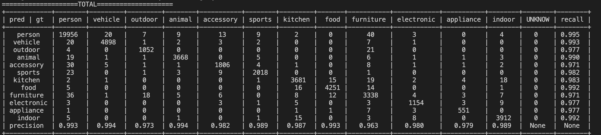
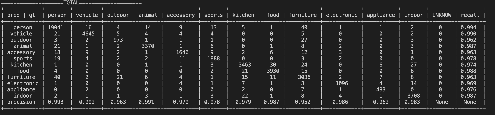

# [Attribute Head Detector]

## Support
- **Attribute Head**

## Submodule of mmdetection-plus

## Performance

**FASTERCNNRCNN分属性性能**


**CASCADECNNRCNN 分属性性能**


**LF性能**
v1(5分类)

| pred/gt | S1 | S2 | S3 | S4 | UNKNOW | recall |
| -- | -- | --| -- | -- | -- | -- |
| S1 | 18254 | 80 | 0 | 2758 | 14 | 0.865 |
| S2 | 0 | 0 | 0 | 0 | 0 | nan |
| S3 | 0 | 0 | 0 | 0 | 0 | nan |
| S4 | 1817 | 43 | 0 | 9134 | 3 | 0.831 |
| precision | 0.909 | 0.000 | nan | 0.768 | None | None |


v2(4分类)

| pred/gt |   S1  |   S2  |  S3 |   S4  | UNKNOW | recall |
| -- | -- | --| -- | -- | -- | -- |
|     S1    | 18925 |   98  |  0  |  2596 |   15   | 0.875  |
|     S2    |   0   |   0   |  0  |   0   |   0    |  nan   |
|     S3    |   0   |   0   |  0  |   0   |   0    |  nan   |
|     S4    |  1349 |   39  |  0  |  9327 |   3    | 0.870  |
| precision | 0.933 | 0.000 | nan | 0.782 |  None  |  None  |


## Config 说明

* FasterRCNN referecne to [Coco_FasterRCNN_ResNet50_attribute_1x.py](config/Coco_FasterRCNN_ResNet50_attribute_1x.py)
* CascadeRCNN reference to [Coco_CascadeRCNN_ResNet50_attribute_1x.py](config/Coco_CascadeRCNN_ResNet50_attribute_1x.py)

**数据集修改**
```python
# dataset   
dataset_type = "AttributeHead.AttrCocoDataset" ### modified

train_pipeline = [
    dict(type="LoadImageFromFile"),
    dict(type="AttributeHead.LoadAnnotations", with_bbox=True, with_attrs=True), ### modified
    dict(type="Resize", img_scale=(1333, 800), keep_ratio=True),
    dict(type="RandomFlip", flip_ratio=0.5),
    dict(type="Normalize", **img_norm_cfg),
    dict(type="Pad", size_divisor=32),
    dict(type="AttributeHead.DefaultFormatBundle"), ### modified
    dict(type="Collect", keys=["img", "gt_bboxes", "gt_labels", "gt_attrs"]), ### modified
]
test_pipeline = ... 

ATTRIBUTES = (
    "person",
    "vehicle",
    "outdoor",
    "animal",
    "accessory",
    "sports",
    "kitchen",
    "food",
    "furniture",
    "electronic",
    "appliance",
    "indoor",
)

data = dict(
    ...
    train=dict(
        ...
        attributes=ATTRIBUTES,
    ),
    val=dict(
        ...
        attributes=ATTRIBUTES,
    ),
    test=dict(
        ... 
        attributes=ATTRIBUTES,
    ),
)
evaluation = dict(interval=1, metric="attr_acc") ### modified
```

**模型修改**

```python
model = dict(
    ...
    roi_head=dict(
        type="AttributeHead.SingleAttrStandardRoIHead", ### modified
        bbox_roi_extractor= ...
        bbox_head=dict(
            type="AttributeHead.Shared2FCBBoxHead",   ### modified
            num_attrs=12,                              ### modified
            use_back_bbox=False,                       ### v1:True v2:False 
            loss_attr=dict(type="CrossEntropyLoss", use_sigmoid=False, loss_weight=0.1), ### modified
            ...
        ),
    ),
```